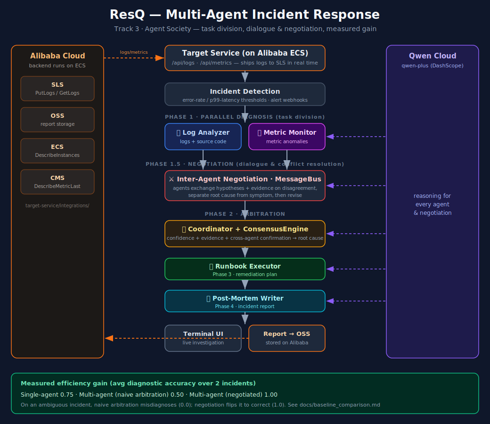

# ResQ — Multi-Agent Incident Response System

An agentic incident response system where specialized AI agents collaborate to diagnose, resolve, and document production incidents. Built for the **1st Qwen Cloud Global AI Hackathon** (Agent Society Track).

## Overview

ResQ connects to your existing infrastructure (logs, metrics, source code, databases) and automatically investigates incidents when they occur. Five specialized agents work in parallel to identify root causes and generate actionable remediation plans.

**Key Features:**
- **Real-time terminal UI** — Watch agents investigate live
- **Inter-agent negotiation** — agents reconcile conflicting diagnoses before the coordinator arbitrates (measurable accuracy gain, see below)
- **5 incident scenarios** — DB pool exhaustion, cache failure, queue failure, memory leak, external API failure
- **Organic AI analysis** — Qwen API analyzes actual logs, metrics, and source code (no hardcoded responses)
- **Source code investigation** — Agents read the codebase at error locations from log markers
- **Live SLS log fetching** — Log Analyzer can pull real logs from Alibaba Cloud SLS (`--sls-incident`)
- **Alibaba Cloud target** — the monitored service runs on ECS and ships to SLS/OSS/ECS/CMS (`target-service/`)

## Architecture



*Qwen Cloud (qwen-plus) powers every agent; the target service runs on Alibaba Cloud ECS and exercises SLS, OSS, ECS, and CMS. Full-resolution diagram: [`docs/architecture.svg`](docs/architecture.svg) (open in a browser and export to PNG for slide decks / Devpost).*

## Documentation

Start here (this README) for the overview. Everything else has one clear purpose:

| Doc | What it covers |
|-----|----------------|
| [`ARCHITECTURE.md`](ARCHITECTURE.md) | Deep dive: agent roles, negotiation, conflict resolution, data flow |
| [`docs/baseline_comparison.md`](docs/baseline_comparison.md) | **Measured** single- vs multi-agent benchmark — the Track 3 efficiency-gain evidence |
| [`docs/architecture.svg`](docs/architecture.svg) | System architecture diagram |
| [`docs/demo_scenarios.md`](docs/demo_scenarios.md) | The 5 local demo incident scenarios, in detail |
| [`target-service/README.md`](target-service/README.md) | The Alibaba-instrumented target service (endpoints, local run) |
| [`target-service/DEPLOY.md`](target-service/DEPLOY.md) | Deploy the target to Alibaba Cloud ECS + capture deployment proof |
| [`docs/devpost_description.md`](docs/devpost_description.md) | Submission text (copy-paste for Devpost) |

## Quick Start

### Prerequisites

- Python 3.10+
- Qwen Cloud API key ([get one here](https://www.qwencloud.com/api-keys))
- Alibaba Cloud account ([free trial](https://www.alibabacloud.com/free-trial))

### Setup

```bash
# Clone the repository
git clone https://github.com/marlyocat/ResQ.git
cd ResQ

# Create virtual environment
python -m venv .venv
source .venv/bin/activate  # or .venv\Scripts\activate on Windows

# Install dependencies
pip install -r requirements.txt

# Configure environment
cp .env.example .env
# Edit .env with your credentials
```

### Run Demo Scenarios

ResQ includes 5 built-in scenarios for demonstration:

```bash
# Scenario 1: Database Connection Pool Exhaustion
python demo/run_demo.py --scenario 1

# Scenario 2: Cache Failure
python demo/run_demo.py --scenario 2

# Scenario 3: Message Queue Failure
python demo/run_demo.py --scenario 3

# Scenario 4: Memory Leak
python demo/run_demo.py --scenario 4

# Scenario 5: External API Dependency Failure
python demo/run_demo.py --scenario 5
```

Each scenario runs a live incident investigation with real Qwen API analysis. Press `q` to exit the terminal UI.

### Production Integration

ResQ investigates a **target service**. In production that's `target-service/`
running on Alibaba Cloud ECS (see [`target-service/DEPLOY.md`](target-service/DEPLOY.md));
point ResQ's terminal at it with `RESQ_TARGET_URL=http://<ecs-ip>:8000`.

To have the Log Analyzer pull **live logs from Alibaba Cloud SLS**, configure
`.env` and run with `--sls-incident`:

```bash
QWEN_API_KEY=your_key                 # required — agent reasoning
ALIBABA_ACCESS_KEY_ID=your_key        # for live SLS log reads
ALIBABA_ACCESS_KEY_SECRET=your_secret
ALIBABA_REGION_ID=ap-southeast-3
SLS_PROJECT=your-project
SLS_LOGSTORE=your-logstore
```

See [`integrations/README.md`](integrations/README.md) for details.

## Project Structure

```
ResQ/
├── agents/                    # Agent implementations
│   ├── log_analyzer.py        # Analyzes logs for error patterns
│   ├── metric_monitor.py      # Analyzes metrics for anomalies
│   ├── coordinator.py         # Arbitrates between hypotheses
│   ├── runbook_executor.py    # Executes remediation steps
│   └── postmortem_writer.py   # Generates incident reports
├── core/                      # Shared infrastructure
│   ├── agent_base.py          # Base agent class
│   ├── communication.py       # Message bus (inter-agent dialogue)
│   ├── consensus.py           # Conflict resolution (scoring/arbitration)
│   ├── negotiation.py         # Inter-agent negotiation round (Phase 1.5)
│   ├── baseline.py            # Single-agent baseline + comparison scorer
│   └── report_generator.py    # HTML incident report
├── integrations/              # Investigator-side connectors
│   ├── qwen_client.py         # Qwen Cloud client (all agent reasoning)
│   ├── alibaba_cloud.py       # SLS log fetching (--sls-incident)
│   └── README.md              # Integration docs
├── demo/                      # Demo scenarios
│   ├── run_demo.py            # Demo runner
│   ├── resq_terminal.py       # Terminal UI (live investigation + negotiation)
│   ├── load_sim.py            # Load simulator
│   └── sample_incidents/      # Incident fixtures (incl. baseline-comparison inputs)
├── target/                    # Local demo target (5 offline failure scenarios)
│   └── app.py                 # Simulated production service
├── target-service/            # Alibaba-instrumented target (deploy to ECS)
│   ├── app.py                 # Flask service wired to SLS/OSS/ECS/CMS
│   └── integrations/          # Real Alibaba Cloud SDK clients ← deployment proof
│       ├── sls_client.py      # SLS PutLogs/GetLogs (aliyun-log-python-sdk)
│       ├── oss_client.py      # OSS object storage (oss2)
│       ├── ecs_client.py      # ECS DescribeInstances
│       └── cms_client.py      # CMS DescribeMetricLast
├── docs/                      # Documentation
│   ├── architecture.svg       # Architecture diagram
│   ├── baseline_comparison.md # Single vs multi-agent measured results
│   ├── demo_scenarios.md      # Scenario descriptions
│   └── devpost_description.md # Submission text
├── tests/                     # Test suite
├── deploy/docker/             # Docker image for the ResQ CLI
├── .env.example               # Environment template
├── requirements.txt           # Python dependencies
└── README.md                  # This file
```

## How It Works

### Incident Detection

ResQ detects incidents via:
1. **Metric polling** — the terminal UI polls the target service's `/api/metrics` and triggers when error rate > 8% or p99 latency > 1500ms
2. **Incident files** — `main.py --incident <file.json>` runs the pipeline on a captured incident
3. **Live SLS logs** — `main.py --sls-incident <file.json>` fetches logs from Alibaba Cloud SLS for the incident window

### Agent Investigation

When an incident is detected, the swarm runs a four-phase workflow:

**Phase 1 — Parallel diagnosis (task division):**
1. **Log Analyzer** — Queries SLS for error logs, extracts stack traces, reads source code at error locations
2. **Metric Monitor** — Analyzes metric anomalies (error rate, latency, CPU, cache hit rate)

**Phase 1.5 — Negotiation (dialogue & conflict resolution):**
3. When the Log Analyzer and Metric Monitor **disagree**, each is shown the other's hypotheses and evidence and re-examines the incident — distinguishing root cause from downstream *symptom* and using the timeline of which signal moved first — then revises. The exchange runs over the `MessageBus` and is recorded for audit. This is what lets a well-supported minority hypothesis override a loud-but-wrong one.

**Phase 2 — Arbitration:**
4. **Coordinator** — Runs the `ConsensusEngine` (confidence + evidence + cross-agent confirmation) over the revised hypotheses and determines the final root cause

**Phase 3–4 — Remediation & documentation:**
5. **Runbook Executor** — Generates and simulates remediation steps
6. **Post-Mortem Writer** — Generates a comprehensive incident report

> **Why negotiation matters:** on an ambiguous incident whose logs point at a memory leak but whose metrics reveal a cache failure, naive arbitration misdiagnoses it — the negotiation round flips it to the correct root cause. See [Multi-Agent Advantage](#multi-agent-advantage--measured) below.

### Report Storage

After investigation completes:
- Report uploaded to OSS: `incidents/YYYY-MM-DD/incident_id.json`
- Available for retrieval and historical analysis

## Multi-Agent Advantage — Measured

Agent Society is judged on a **measurable efficiency gain over single-agent baselines**. ResQ ships a reproducible 3-way benchmark that runs the *identical* incident (same logs + metrics) through three pipelines and scores them on identical metrics:

```bash
python main.py --baseline-comparison demo/sample_incidents/conflicting_signals.json
```

| Incident | Single-Agent | Multi-Agent (naive) | Multi-Agent (negotiated) |
|---|:---:|:---:|:---:|
| Clear-cut (DB pool exhaustion) | 0.5 | 1.0 | 1.0 |
| **Ambiguous (cache failure disguised as memory leak)** | 1.0 | **0.0** ❌ | **1.0** ✅ |
| **Average diagnostic accuracy** | 0.75 | 0.50 | **1.00** |

**The negotiated swarm is the only pipeline that solves both incidents.** On the ambiguous case, the specialists disagree; the negotiation round persuades the Log Analyzer to drop the memory-leak red herring, and the Coordinator lands the correct cache root cause (accuracy **0.0 → 1.0**).

The gain is **diagnostic robustness, not speed** — the swarm makes many more model calls (~140s vs. ~25s for the single agent). Full methodology and per-metric results (hypotheses, evidence quality, post-mortem completeness, latency) are in [`docs/baseline_comparison.md`](docs/baseline_comparison.md).

## 5 Demo Scenarios

| # | Scenario | What It Demonstrates |
|---|----------|---------------------|
| 1 | **DB Connection Pool Exhaustion** | Resource exhaustion, connection timeouts |
| 2 | **Cache Failure** | Cache miss storm, DB overload |
| 3 | **Message Queue Failure** | Distributed service communication breakdown |
| 4 | **Memory Leak** | Gradual degradation, OOM kill |
| 5 | **External API Failure** | Third-party dependency, cascading timeouts |

Each scenario produces distinct logs and metrics. Qwen API analyzes the actual data to produce unique root cause analysis — no hardcoded responses.

## Technology Stack

| Component | Technology | Purpose |
|-----------|-----------|---------|
| **LLM** | Qwen Cloud (qwen-plus) | Agent reasoning, negotiation, analysis |
| **Terminal UI** | Textual + Rich | Live investigation display |
| **Compute** | Alibaba Cloud ECS | Hosts the target service |
| **Logs** | Alibaba Cloud SLS | Real-time log shipping + querying |
| **Storage** | Alibaba Cloud OSS | Incident report storage |
| **Monitoring** | Alibaba Cloud CMS | Host metrics |
| **IaC** | Terraform | Provisions the ECS/SLS/OSS deployment |

## Free Tier Availability

The Alibaba Cloud services used are available on the free tier:

- **Qwen API** — Free credits for hackathon participants
- **SLS** — 500MB/day log ingestion
- **OSS** — 5GB storage
- **ECS** — 3-month free trial for new users

## Hackathon Submission

- **Track:** Agent Society (Track 3)
- **Demo Video:** [YouTube link]
- **Architecture Diagram:** [`docs/architecture.svg`](docs/architecture.svg) (renders inline below)
- **Proof of Alibaba Cloud Deployment:** the target service runs on Alibaba Cloud ECS and exercises four Alibaba services through the official SDKs — see [`target-service/integrations/sls_client.py`](target-service/integrations/sls_client.py) (SLS `PutLogs`/`GetLogs`), [`oss_client.py`](target-service/integrations/oss_client.py) (OSS), [`ecs_client.py`](target-service/integrations/ecs_client.py) (ECS `DescribeInstances`), and [`cms_client.py`](target-service/integrations/cms_client.py) (CMS `DescribeMetricLast`). Infrastructure-as-code for the ECS deployment is in [`target-service/deploy/terraform/`](target-service/deploy/terraform/).

### Two targets, one system

ResQ (the multi-agent investigator) monitors a *target service* and investigates when it degrades:

- **`target-service/`** — the **Alibaba-instrumented** production target. Ships its logs to SLS in real time, stores reports in OSS, and reports ECS/CMS context. Deploy it to ECS with the step-by-step runbook in [`target-service/DEPLOY.md`](target-service/DEPLOY.md); point ResQ at it with `RESQ_TARGET_URL=http://<ecs-ip>:8000`.
- **`target/`** — a **local, offline** target with 5 self-contained failure scenarios, for running the demo without any cloud dependencies.

## License

MIT License — see [LICENSE](LICENSE)
